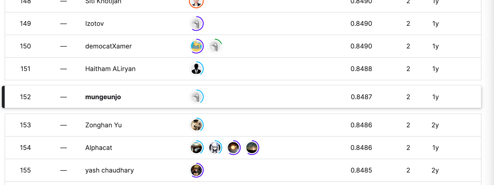

# Google AI4Code-Understand Code in Python Notebook

*프로젝트 수행 이력: 2022.03.01 ~ 2022.06.31*

*2024.01.28 포트폴리오 목적으로  Readme 작성 후 업로드: 조문근*

- [Google AI4Code-Understand Code in Python Notebook](#google-ai4code-understand-code-in-python-notebook)
  * [Abstract](#abstract)
  * [1 개요](#1---)
    + [1.1 프로젝트의 특징과 기대되는 성과](#11------------------)
    + [1.2 예상되는 리스크와 대응방안](#12---------------)
  * [2 문제 정의](#2------)
    + [2.1 성능의 평가](#21-------)
  * [2 모델링](#2----)
    + [2.1 DistillBERT-small](#21-distillbert-small)
    + [2.1 GraphCodeBERT](#21-graphcodebert)
  * [3 결과](#3---)
  * [Reference](#reference)

## Abstract

본 문서는 본인이 2022년 1학기 건국대학교 SW중심대학 장학활동으로 수행하였던 프로젝트의 요약본임. 이에 따라 결과보단 과정이 우선적으로 작성됨. 

## 1 개요

### 1.1 프로젝트의 특징과 기대되는 성과

본 프로젝트는 Kaggle 플랫폼을 이용하고 Google에서 주최한 AI 경진대회를 수행하며, 거대 언어 모델의 성능 향상에 대한 다양한 방법론들을 실질적으로 경험해보는 것임. 1) 오로지 성능만을 평가한다는 것과 리더보드에 2) 타 팀의 코드를 참조할 수 있다는 점에서 팀원들의 개별적인 모델링 역량 향상에 많은 도움이 될 것으로 기대됨.

### 1.2 예상되는 리스크와 대응방안

오로지 모델의 성능 만을 평가한다는 점에서 해당 모델이 사용되는 비즈니스의 맥락, 코드의 품질, 엔지니어링, 협업 역량 등 모델링 이외 것들에 대한 역량 향상을 등한시할 우려가 있음. 이에 따라, 팀원들 개별적으로 여타 활동을 통한 종합적인 역량 향상이 요구됨.

## 2 문제 정의

Kaggle Competition이라, 풀고자하는 문제가 명확하게 정의되어 있었음. 올바른 순서로 주어진 코드셀과 무작위 순서로 주어진 마크다운 순서가 있을 때, 마크다운 셀을 원래 순서대로 배치하는 문제임. 학습 데이터는 16만개의 .ipynb 파일임.

### 2.1 성능의 평가

Kendall tau 상관계수로 평가함. $S_i$는 i번째 주피터 노트북의 셀의 실제 순서 인덱스와 예측 순서 인덱스의 i의 inversion의 합임. $n_i$는 i번째 주피터 노트북의 셀 갯수임.

$$
K=1-4{\sum_i S_i\over \sum_i n_i(n_i-1)}
$$

오차의 정도(실제 순서 인덱스와 예측 순서 인덱스의 차이)가 반영된다는 특징이 있음. 따라서 일부를 정확하게 예측하는 것보다 전체를 대략적으로 맞추는 경우가 더 좋은 평가를 받을 수 있음. 따라서 다양한 일반화 방법론 적용에 따른 성능 향상이 예상됨.

## 2 모델링

베이스라인은 distillBERT-small의 코드셀들과 예측할 마크다운 셀을 입력으로 받고 정규화된 순서를 반환하는 모델임. distillBERT에 fine tuning을 진행함. 베이스 라인 모델 성능는 약 0.75임. 최종 모델의 성능은 약 0.85이며, 아래의 2가지 확률 모델을 실험적으로 검증 후 3:1비율로 앙상블하였음. 

### 2.1 DistillBERT-small

허깅페이스의 distillBERT-small 모델을 외부에서 마련한 프로그래밍언어 데이터셋에 대해 사전학습을 한 후, 주어진 훈련 데이터셋에 대해 NSP 방법론으로 파인튜닝하였음. 가용 인프라를 고려하여 large, base 모델보단 small 모델을 선택하였음. 모델의 성능은 0.82로 베이스라인에 비해 큰 성능향상을 확인하였음.

▶ **Adaptive Pretraining: MLM -** distill_BERT_small/Pretrainer.py

주어진 데이터셋은 파이썬과 자연어로 이루어진 언어 조각들임. 즉 Huggingface 등 외부에서 유사한 데이터를 구하기가 쉬움. 해당 외부데이터는 주최측이 보유하고 있는 데이터의 특징과 완전히 같지는 않지만, 파이썬 코드라는 점에서 어느정도 모델 성능 향상에 기여할 여지가 있음. 이에 따라 해당 외부 데이터들을 파인 튜닝 목적으로 사용하기 보다는, 사전학습을 통해 내재된 코드에 대한 지식을 모델에 전수하는 것이 적절하다고 판단하였음. 

외부데이터는 사전학습용으로 이미 전처리가 되어 있는 데이터라, Python 코드만 선별한 후 문장 별로 구분한 후 하나의 텍스트 파일에 저장하여 사용하였음. 사전학습의 방법론은 NSP, MLM 중 효용성이 불확실한 NSP를 제외한 MLM만 수행하였음. 마스킹 비율은 기존 BERT의 사전학습과 동일하게 0.15임. 토크나이저는 distillBERT의 사전학습용 토크나이저를 그대로 사용함. 

▶ **Pairwise finetuning: NSP -** distill_BERT_small/FineTuner.py

코드의 순서를 예측하는 작업이라는 측면에서 NSP를 응용한 Pairwise 방법론을 사용하였음. 임의의 마크다운 셀과의 유사도를 구하는 문제임. 훈련 데이터셋은 마크다운 셀 바로 뒤에나오는 코드셀의 레이블은 1, 아니면 0임. 유사도를 측정하므로 회귀 모델임. 출력 노드에 sigmoid를 사용, 또한 오차에 대한 선형적인 손실을 부여하는 L1Loss를 사용하였음. 

### 2.1 GraphCodeBERT

베이스라인의 기타 추가 feature를 추가하고, 모델을 매우 큰 크기의 다양한 프로그래밍 언어에서 사전학습된 GraphCodeBERT-base로 변경한 후 fine tuning을 진행하였음. 결과는 약 0.84로, 위 모델에 비해 약간의 성능향상을 확인하였음. 

▶ **Rank regression finetuning** - graphcode_BERT_base/Model.py

주어진 코드셀들과 예측할 마크다운 셀을 입력으로 받고 정규화된 순서를 반환하는 회귀 모델임. 추가적인 feature로 코드셀, 마크다운셀의 각각의 개수를 주었음. 출력 노드에 sigmoid를 사용하였으며 오차에 대한 선형적인 손실을 부여하는 L1Loss를 사용하였음.  

▶ **Mixed Precision Training**- graphcode_BERT_base/train.py

모델의 크기가 거대해 학습 시간이 이틀 이상으로 매우 오래 걸리는 이슈가 발생하였음. 이에 따라 1) 가장 사용에 용이하다는 것 2) 학습 시간 뿐만 아니라 예측 성능 향상도 기대할 수 있다는 점을 고려하여 순전파 및 역전파 등의 가중치 연산은 16FP, 가중치 갱신에는 32FP를 사용하는  혼합 정밀도 연산을 학습에 수행하였음. 총 학습 시간 30시간으로 감소하였음. 

## 3 결과

제출 기간 종료 직후 상위 10% 였는데, 한 동안 까먹고 있다가 다시 확인해보니 약간 순위가 떨어짐(상위 15%). 구글 측에서 제출 기간 종류 이후에 추가적인 테스트 데이터 셋으로 재검증을 진행하면서 약간 순위가 떨어진것으로 추측함.

Competition에서 대략 상위 10%를 달성 및 단일 Task에 대한 다양한 모델링을 경험하였음. 역량 향상 측면에서는 크게 1) 거대 언어 모델을 목적에 맞게 직접 사전학습 시킬 수 있음 2) 사전학습된 거대 언어 모델을 목적에 맞게 finetuning 할 수 있음 3) 혼합 정밀도 연산을 학습에 적용해 성능, 비용을 개선시킬 수 있는 역량을 얻게 됨.

## Reference

▶ **추가적인 사전학습을 통한 성능 개선**

[1] Suchin Gururangan et al., “Don’t Stop Pretraining: Adapt Language Models to Domains and Tasks”, ACL 2020

▶ **CodeBERT**

[1] Zhangyin Feng et al., “CodeBERT: A Pre-Trained Model for Programming and Natural Languages”, EMNLP 2020

▶ **혼합 정밀도 학습을 통한 성능 개선**

[1] Paulius Micikevicius et al., “Mixed Precision Training”, ICLR 2018