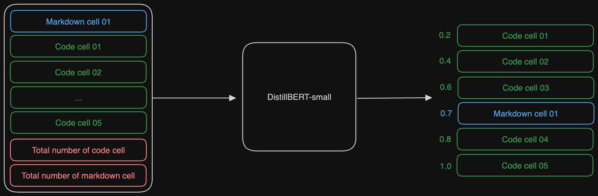

# Google AI4Code – Understand Code in Python Notebooks

_프로젝트 수행 이력: 2022.03.01 ~ 2022.06.31_

_2024.01.28 포트폴리오 목적으로 Readme 작성 후 업로드: 조문근_

### 1 개요
올바른 순서로 주어진 코드셀과 무작위 순서로 주어진 마크다운 순서가 있을 때, 마크다운 셀을 원래 순서대로 배치하는 문제임. 학습 데이터는 16만개의 주피터 노트북 파일임.
### 2 성능 평가
아래의 Kendall tau 상관계수로 평가함. $S_i$는 i번째 주피터 노트북의 셀의 실제 순서 인덱스와 예측 순서 인덱스의 i의 inversion의 합임. $n_i$는 i번째 주피터 노트북의 셀 갯수임. $S_i$가 미분불가능하기에, 오차최소화 관점으로 접근하여 손실함수로 Metric을 사용하는 방법은 불가능함.
$$
K=1-4{\sum_i S_i\over \sum_i n_i(n_i-1)}
$$
### 3 데이터
약 16만개의 주피터노트북이 주어짐. 셀은 분할되어 있음. 아래는 단일 주피터노트북 데이터 예시임.

| cell_id  | cell_type | source                                                                                                                  |
| -------- | --------- | ----------------------------------------------------------------------------------------------------------------------- |
| 1087237d | code      | # Data manipulation\nimport pandas as pd\nimport numpy as np\n\n# Data visualization\nimport matplotlib.pyplot as pl... |
| d7209f1f | code      | fifa_raw_dataset = pd.read_csv('../input/data.csv')                                                                     |
| e404213c | code      | fifa_raw_dataset.head()                                                                                                 |
| 2bad59b0 | markdown  | 1. # Data exploration                                                                                                   |
| e7e67119 | markdown  | # # Data preprocessing                                                                                                  |
| b3c6bc16 | markdown  | # Post-process for submission                                                                                           |
### 4 모델링
모델링에 고려할 요소는 가정용 GPU(RTX 3090TI 24GB)에서 실행 가능해야 하기에 1) Capacity 2) 추론 성능임. 베이스라인에서 모델 변경 후 0.75 -> 0.84의 성능 향상, 외부데이터에 대한 사전학습과 다른 방식의 finetuning을 진행했을 때 0.75->0.82의 성능 향상을 확인하였음. 최종 모델은 모델1과 모델2의 3:1 Weighted voting 앙상블로, 0.85의 성능을 확인함.

| #    | 모델명                                  | Score | Finetuning       |
| --- | ------------------------------------- | ----- | ------------------ |
| Baseline    | DistillBERT-small                     | 0.75  | Normalized Ranking Regression |
| Model 01    | CodeBERT-base                         | 0.84  | Normalized Ranking Regression |
| Model 02    | MLM + DistillBERT-small | 0.82  | Pairwise Similarity Classification        |
| Model 03    | Model 01, Model 02 앙상블                                | 0.85  | 3:1 Weighted voting                  |
#### 4.1 Model 01 ・ CodeBERT-base ・ 0.84
CodeBERT-base 모델에 Finetuning을 하는 방식을 적용하였음. Finetuning은 모든 코드셀의 임베딩과 예측할 마크다운셀의 임베딩, 셀의 개수가 주어질 때 마크다운 셀의 정규화된 순서를 예측하는 Ranking Regression 방식을 진행하였음. 토크나이저는 CodeBERT 토크나이저 그대로 사용하였음. Metric에 오차의 정도에 대한 가중이 없으므로, 오차에 대한 선형적인 손실을 부여하는 L1-Loss(MAE)를 사용하였음.
##### 모델 정의
올바른 순서로 주어진 코드셀 20개의 임베딩과 순서를 예측할 마크다운셀 1개의 임베딩, 코드셀과 마크다운 셀의 개수가 입력임. 정규화된 순서를 출력함. 아래는 마크다운 셀 01의 모델 예측값이 0.7일 때의 Ranking 예시임.

#### 4.2 Model 02 ・ DistllBERT-small ・ 0.82
DistillBERT-small 모델에 외부데이터로 Masked Language Modeling 사전학습하였음. 단일 코드셀과 마크다운셀의 연속됨 여부로 True or False를 예측하는 이진 분류 방식으로 finetuing하였음. 코드셀 N개와 마크다운셀 M개에 대해 예측의 결과인 NxM 행렬을 유사도 행렬이라고 간주하고 Softmax함수로 코드셀과 마크다운셀을 짝지었음.
##### 사전 학습
주어진 데이터셋은 자연어+프로그래밍언어로 이루어졌음. 외부에서 유사한 데이터셋을 구하기에 용이함. 따라서 해당 외부 데이터들로 사전학습을 수행함. 효용성이 검증되지 않은 NSP는 제외하고 MLM으로만 사전학습을 진행함. 사전학습에 드는 컴퓨팅 리소스를 고려하여 DistillBERT-small모델을 사용하였음.
##### 모델 정의
주어진 데이터셋에서 연속된 순서의 마크다운셀-코드셀 쌍을 True,
아닌 쌍을 False로 맞춘 후 1:1 비율로 샘플링함. 이진 분류이므로Binary Cross Entropy를 손실함수로 사용함. 이후 N개의 코드셀과 M개의 마크다운셀로 이루어진 주피터노트북에 대해 NxM번 추론을 수행하여 유사도 행렬을 생성함. 해당 행렬에 Softmax를 통해 가장 유사한 코드셀-마크다운셀을 짝지음. 단일 코드셀에 여러 마크다운셀이 할당될 경우 Softmax 값의 내림차순 정렬임. 아래는 3개의 코드셀과 4개의 마크다운셀로 이루어진 주피터노트북의 순서 예측 예시임.

### 5 Reference
1. Suchin Gururangan et al., “Don’t Stop Pretraining: Adapt Language Models to Domains and Tasks”, ACL 2020
2. Zhangyin Feng et al., “CodeBERT: A Pre-Trained Model for Programming and Natural Languages”, EMNLP 2020
3. Paulius Micikevicius et al., “Mixed Precision Training”, ICLR 2018